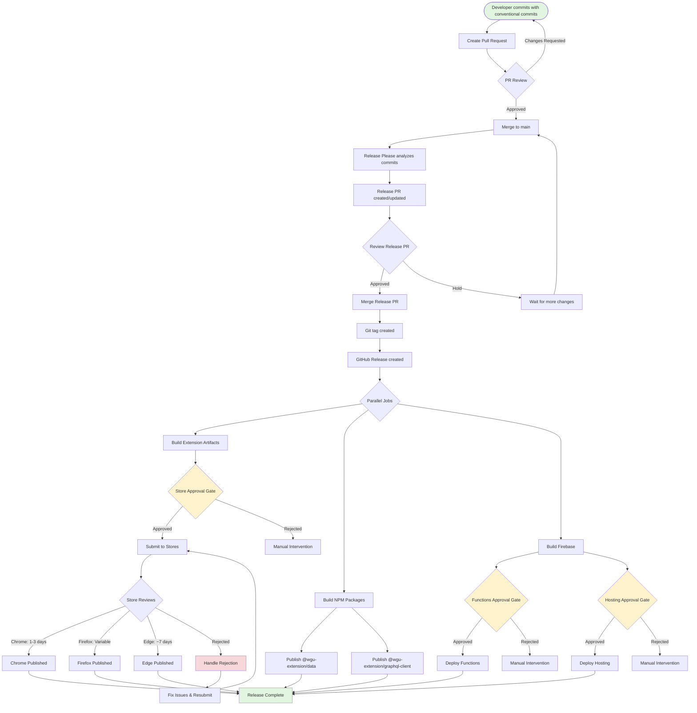
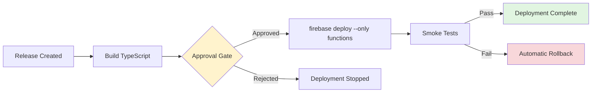
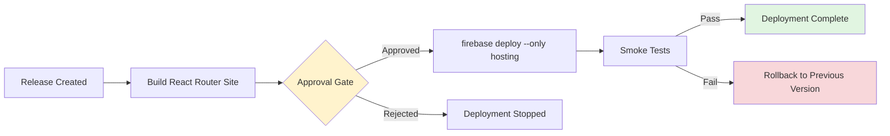
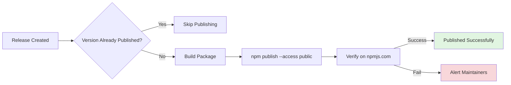
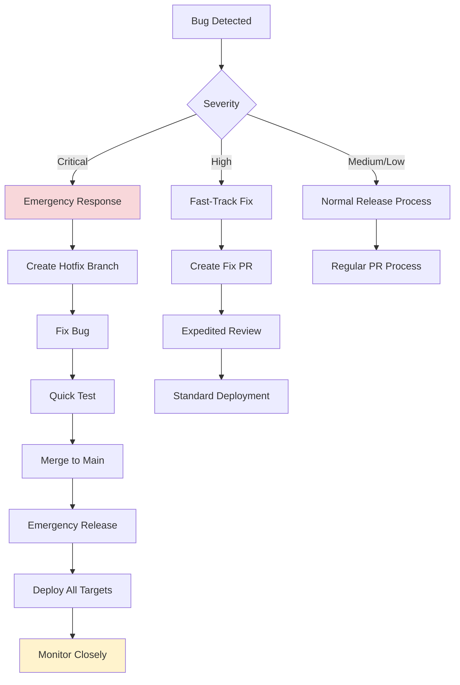

# WGU Extension Release Strategy

## Overview

This document outlines the comprehensive release strategy for the WGU Extension monorepo, covering browser extensions, NPM packages, and Firebase deployments. The strategy uses automated workflows with approval gates to ensure quality while minimizing manual intervention.

## Table of Contents

- [Release Philosophy](#release-philosophy)
- [Components & Artifacts](#components--artifacts)
- [Complete Release Workflow](#complete-release-workflow)
- [Platform-Specific Requirements](#platform-specific-requirements)
- [Automated Workflows](#automated-workflows)
- [Manual Approval Gates](#manual-approval-gates)
- [Emergency Procedures](#emergency-procedures)
- [Store Rejection Handling](#store-rejection-handling)
- [Monitoring & Alerts](#monitoring--alerts)
- [Troubleshooting](#troubleshooting)

---

## Release Philosophy

### Principles

1. **Conventional Commits**: All releases are driven by semantic versioning via conventional commits
2. **Automated by Default**: Prefer automation with safety gates over manual processes
3. **Fail-Safe**: Use approval gates for critical deployments (stores, production)
4. **Auditable**: All releases tracked in Git tags, GitHub Releases, and CHANGELOG.md
5. **Reversible**: Support rollback for all deployment types

### Release Types

| Type | Trigger | Automated | Approval Required | Deployment Time |
|------|---------|-----------|-------------------|-----------------|
| **Extension Stores** | Release tag | Yes | Yes (Environment) | 24hrs-7 days (review) |
| **NPM Packages** | Release tag | Yes | No | ~5 minutes |
| **Firebase Functions** | Release tag | Yes | Yes (Environment) | ~5-10 minutes |
| **Firebase Hosting** | Release tag | Yes | Yes (Environment) | ~2-5 minutes |

---

## Components & Artifacts

### Browser Extension

**Build Artifacts:**
- `unofficial-wgu-extension-chrome.zip` - Chrome Web Store package
- `unofficial-wgu-extension-firefox.zip` - Firefox Add-ons package
- `unofficial-wgu-extension-firefox-sources.zip` - Firefox source code (required)
- `unofficial-wgu-extension-edge.zip` - Microsoft Edge Add-ons package

**Distribution:**
- [Chrome Web Store](https://chromewebstore.google.com/)
- [Firefox Add-ons (AMO)](https://addons.mozilla.org/)
- [Microsoft Edge Add-ons](https://microsoftedge.microsoft.com/addons/)
- GitHub Releases (manual sideload)

### NPM Packages

**Published Packages:**
- `@wgu-extension/data` - Community data types and schemas
- `@wgu-extension/graphql-client` - GraphQL client library

**Unpublished (Internal):**
- `@wgu-extension/functions` - Firebase Functions (deployed, not published)
- `unofficial-wgu-extension` - Extension (distributed via stores only)
- `unofficial-wgu-extension-site` - Website (hosted on Firebase)

### Firebase Deployments

**Functions:**
- `publicApi` - Public GraphQL endpoint
- `adminApi` - Protected admin endpoint
- `exportDataApi` - Data export utility
- `processSuggestionsApi` - Suggestion processing

**Hosting:**
- React Router v7 website
- Static assets and documentation

---

## Complete Release Workflow



---

## Platform-Specific Requirements

### Chrome Web Store

**Review Process:**
- **Timeline**: 90% complete within 3 days, most within 24 hours
- **Publish Window**: 30 days after approval to publish, or reverts to draft
- **Re-review**: Required if package changes after approval

**Requirements:**
- Valid `manifest.json` with all required fields
- Privacy policy URL (if collecting data)
- Store listing metadata (description, screenshots, etc.)
- No policy violations (malware, deceptive content, etc.)

**Common Rejection Reasons:**
1. Broad host permissions without justification
2. Minified/obfuscated code without explanation
3. Missing or inadequate privacy policy
4. Functionality doesn't match description
5. Violation of single purpose policy

**Submission Command:**
```bash
cd extension && npx wxt submit --chrome-zip .output/*-chrome.zip
```

**Required Secrets:**
- `CHROME_EXTENSION_ID` - Extension ID from Chrome Web Store
- `CHROME_CLIENT_ID` - OAuth client ID
- `CHROME_CLIENT_SECRET` - OAuth client secret
- `CHROME_REFRESH_TOKEN` - OAuth refresh token

**Review Status Tracking:**
- Check Chrome Web Store Developer Dashboard
- Email notifications for status changes
- No automated status check via API

### Firefox Add-ons (AMO)

**Review Process:**
- **Timeline**: Not publicly disclosed, typically 1-7 days
- **Source Code**: Required for extensions with minified/obfuscated code
- **Automated**: Initial automated validation, then manual review if flagged

**Requirements:**
- Max file size: 200 MB
- Source code ZIP if using build tools (must include `README.md` or `SOURCE_CODE_REVIEW.md`)
- Listing on AMO (name, summary, description, categories)
- Privacy policy if collecting data

**Source Code Requirements:**
```markdown
# SOURCE_CODE_REVIEW.md

## Build Instructions
1. Install Node.js 22+
2. Install pnpm: `npm install -g pnpm`
3. Run: `pnpm install`
4. Build: `pnpm --filter=extension run build:prod`
5. Output: `extension/.output/unofficial-wgu-extension-firefox-v{version}.zip`

## Notes
- The build is deterministic
- Uses WXT framework with Vite
- Tailwind CSS is compiled during build
```

**Submission Command:**
```bash
cd extension && npx wxt submit \
  --firefox-zip .output/*-firefox.zip \
  --firefox-sources-zip .output/*-sources.zip
```

**Required Secrets:**
- `FIREFOX_EXTENSION_ID` - Extension UUID from AMO
- `FIREFOX_JWT_ISSUER` - API key (JWT issuer)
- `FIREFOX_JWT_SECRET` - API secret

**Review Status Tracking:**
- Check AMO Developer Hub
- Email notifications for status changes
- API available for automated status checks

### Microsoft Edge Add-ons

**Review Process:**
- **Timeline**: Up to 7 business days
- **Status Updates**: Via Partner Center dashboard
- **Fast-track**: Extensions with established track record may review faster

**Requirements:**
- Store listing with display name, descriptions (250-5,000 chars)
- Extension logo (300x300px minimum, 1:1 aspect ratio)
- Category selection
- Privacy policy declaration and URL
- Mature content flag if applicable

**Optional but Recommended:**
- Small promotional tile (440x280px)
- Large promotional tile (1400x560px)
- Screenshots (640x480 or 1280x800px, up to 10)
- YouTube video
- Search terms (max 21 words, up to 7 terms)

**Submission Command:**
```bash
cd extension && npm exec --yes edge-addons-cli@1.12.0 upload \
  --product-id "${EDGE_PRODUCT_ID}" \
  --zip ".output/*-edge.zip" \
  --client-id "${EDGE_CLIENT_ID}" \
  --client-secret "${EDGE_CLIENT_SECRET}" \
  --access-token-url "https://login.microsoftonline.com/${EDGE_TENANT_ID}/oauth2/v2.0/token" \
  --wait-for-publish
```

**Required Secrets:**
- `EDGE_PRODUCT_ID` - Product ID from Partner Center
- `EDGE_CLIENT_ID` - Azure AD client ID
- `EDGE_CLIENT_SECRET` - Azure AD client secret
- `EDGE_TENANT_ID` - Azure AD tenant ID

**Review Status Tracking:**
- Check Partner Center dashboard
- Email notifications for status changes
- API available via edge-addons-cli

### Firebase Functions

**Deployment Process:**


**Requirements:**
- All TypeScript compiles without errors
- Unit tests pass
- Integration tests pass (optional but recommended)
- No breaking changes to public API without version bump

**Deployment Command:**
```bash
pnpm --filter=functions run deploy
# Or specific function:
firebase deploy --only functions:publicApi
```

**Smoke Tests After Deployment:**
1. Health check: Query `ping` on public endpoint
2. Sample query: Fetch one course
3. Error handling: Test invalid query
4. Rate limiting: Verify rate limit enforcement

**Rollback Procedure:**
```bash
# List recent deployments
firebase functions:log

# Rollback to previous version
firebase deploy --only functions --force
```

### Firebase Hosting

**Deployment Process:**


**Requirements:**
- React Router build completes successfully
- No broken links
- GraphQL client configured for production endpoint
- Static assets optimized

**Deployment Command:**
```bash
pnpm --filter=site run build
firebase deploy --only hosting
```

**Smoke Tests After Deployment:**
1. Homepage loads successfully
2. GraphQL queries work
3. Search functionality operational
4. Mobile responsive design verified

**Rollback Procedure:**
```bash
# List recent releases
firebase hosting:releases

# Rollback to specific release
firebase hosting:rollback
```

### NPM Packages

**Publishing Process:**


**Packages:**

1. **@wgu-extension/data**
   - Types and schemas for community data
   - Auto-publishes on release
   - Skips if version already published

2. **@wgu-extension/graphql-client**
   - GraphQL client library with types
   - Auto-publishes on release
   - Requires `@wgu-extension/functions` types

**Publishing Commands:**
```bash
# Data package
cd data && pnpm publish --access public --no-git-checks

# GraphQL client
cd graphql-client && pnpm publish --access public --no-git-checks
```

**Required Secret:**
- `NPM_TOKEN` - NPM authentication token with publish access

**Verification:**
```bash
# Check published version
npm view @wgu-extension/data version
npm view @wgu-extension/graphql-client version

# Test installation
npm install @wgu-extension/data@latest
npm install @wgu-extension/graphql-client@latest
```

---

## Automated Workflows

### Release Please Workflow

**File:** `.github/workflows/release-please.yml`

**Trigger:** Push to `main` branch

**Jobs:**
1. **release-please**: Analyzes commits and creates/updates release PR
2. **build-release**: Builds extension artifacts on release creation
3. **publish-data-final**: Publishes `@wgu-extension/data` to NPM
4. **publish-graphql-client**: Publishes `@wgu-extension/graphql-client` to NPM
5. **store-submission**: Submits to browser stores (requires approval)
6. **deploy-functions**: Deploys Firebase Functions (requires approval)
7. **deploy-hosting**: Deploys Firebase Hosting (requires approval)

**Approval Gates:**
- **store-submission**: Uses `store-submission` environment
- **deploy-functions**: Uses `production-firebase` environment
- **deploy-hosting**: Uses `production-firebase` environment

### Store Submission Workflow

**Approval Requirements:**
- Environment: `store-submission`
- Reviewers: Repository maintainers
- Wait timer: 5 minutes (allows for cancellation)

**Steps:**
1. Build production extension for all browsers
2. Wait for approval (or auto-approve after 5 minutes if no reviewers)
3. Submit to Chrome Web Store (if secrets configured)
4. Submit to Firefox Add-ons (if secrets configured)
5. Submit to Microsoft Edge Add-ons (if secrets configured)
6. Comment on release with submission status

**Graceful Failures:**
- Missing secrets: Skip that store, continue with others
- Submission failure: Log error, continue with other stores
- Store rejection: Create GitHub issue for tracking

### Firebase Deployment Workflow

**Approval Requirements:**
- Environment: `production-firebase`
- Reviewers: Repository maintainers
- Wait timer: 10 minutes

**Functions Deployment:**
1. Install dependencies
2. Build TypeScript
3. Wait for approval
4. Deploy functions to Firebase
5. Run smoke tests
6. Report deployment status

**Hosting Deployment:**
1. Install dependencies
2. Build React Router site
3. Wait for approval
4. Deploy to Firebase Hosting
5. Run smoke tests
6. Report deployment status

### NPM Publishing Workflow

**No Approval Required** (fully automated)

**Data Package:**
1. Check if version already published
2. Skip if already exists
3. Build types
4. Publish to NPM with public access

**GraphQL Client:**
1. Check if version already published
2. Skip if already exists
3. Build library
4. Publish to NPM with public access

---

## Manual Approval Gates

### Configuring GitHub Environments

**Store Submission Environment:**
```yaml
name: store-submission
protection_rules:
  required_reviewers:
    - @maintainer1
    - @maintainer2
  wait_timer: 5  # minutes
deployment_branch_policy:
  protected_branches: true
```

**Production Firebase Environment:**
```yaml
name: production-firebase
protection_rules:
  required_reviewers:
    - @maintainer1
    - @maintainer2
  wait_timer: 10  # minutes
deployment_branch_policy:
  protected_branches: true
```

### Approval Process

1. **Notification**: Approvers receive email/notification from GitHub
2. **Review**: Check the release notes, CHANGELOG.md, and diff
3. **Approval Options:**
   - **Approve**: Deployment proceeds immediately
   - **Reject**: Deployment is cancelled, issue created for tracking
   - **Timeout**: After wait timer expires, auto-approves (if configured)

4. **Review Checklist:**
   - [ ] CHANGELOG.md accurately reflects changes
   - [ ] Version bump is correct (major/minor/patch)
   - [ ] No security vulnerabilities in dependencies
   - [ ] Breaking changes are documented
   - [ ] Tests are passing in CI
   - [ ] No critical bugs reported in latest commits

### Emergency Override

**When to Use:**
- Critical security patch
- Production outage requiring immediate fix
- Store rejection requiring urgent resubmission

**Process:**
1. Merge hotfix to `main` (bypass PR reviews if necessary)
2. Release Please creates emergency release PR
3. Manually merge release PR immediately
4. Manually approve all deployment gates
5. Monitor deployments closely
6. Document incident in post-mortem

**Commands:**
```bash
# Skip waiting for approval (GitHub CLI)
gh run approve <run-id>

# Force deploy Firebase
firebase deploy --force --only functions,hosting

# Manual store submission
cd extension && npx wxt submit --chrome-zip .output/*-chrome.zip
```

---

## Emergency Procedures

### Critical Bug in Production

**Scenario:** Extension or Functions deployed with critical bug



**Steps:**

1. **Assessment** (5 minutes):
   - Severity: Critical, High, Medium, Low
   - Impact: How many users affected?
   - Workaround: Is there a temporary fix?

2. **Response** (Critical only):
   ```bash
   # Create hotfix branch
   git checkout -b hotfix/critical-bug-fix main

   # Make minimal fix
   # ... edit files ...

   # Commit with conventional commit
   git commit -m "fix!: resolve critical bug in X"

   # Push and create PR
   git push origin hotfix/critical-bug-fix
   gh pr create --title "HOTFIX: Critical bug fix" --body "Emergency fix for critical bug"

   # Merge immediately (bypass reviews if necessary)
   gh pr merge --squash --admin

   # Release Please will create release PR
   # Manually merge release PR

   # Approve all gates immediately
   ```

3. **Deployment**:
   - **Extension**: Submit to stores, request expedited review
   - **Functions**: Deploy immediately with `--force`
   - **Hosting**: Deploy immediately
   - **NPM**: Publish patch version

4. **Communication**:
   - Update GitHub release with known issues
   - Post to user communities (if public-facing)
   - Internal incident tracking

5. **Post-Mortem**:
   - Root cause analysis
   - Update tests to prevent regression
   - Review and update emergency procedures

### Rollback Procedures

**Browser Extension:**
```bash
# Extension rollback requires store resubmission
# 1. Find previous version tag
git tag -l | grep extension

# 2. Checkout previous version
git checkout <previous-tag>

# 3. Build and submit
cd extension
pnpm run build:prod
pnpm run zip
pnpm run zip:firefox
pnpm run zip:edge

# 4. Submit to stores (manual or via workflow)
npx wxt submit --chrome-zip .output/*-chrome.zip
```

**Firebase Functions:**
```bash
# List recent deployments
firebase functions:log

# Redeploy previous version
git checkout <previous-tag>
cd functions
pnpm run build
pnpm run deploy
```

**Firebase Hosting:**
```bash
# Rollback to previous release
firebase hosting:rollback
```

**NPM Packages:**
```bash
# Deprecate bad version
npm deprecate @wgu-extension/data@x.y.z "Contains critical bug, use x.y.w instead"

# Publish patch version
# ... make fixes ...
cd data
pnpm version patch
pnpm publish --access public
```

### Data Loss Prevention

**Firestore Backup Before Major Updates:**
```bash
# Export Firestore data
gcloud firestore export gs://wgu-extension-backups/$(date +%Y%m%d)

# Verify export
gcloud firestore operations list
```

**Restore from Backup:**
```bash
# Import Firestore data
gcloud firestore import gs://wgu-extension-backups/20250118
```

---

## Store Rejection Handling

### Common Rejection Scenarios

#### Chrome Web Store

| Rejection Reason | Fix | Resubmission Time |
|-----------------|-----|-------------------|
| **Broad Host Permissions** | Add justification in description, reduce permissions | Same day |
| **Minified Code** | Add explanation, provide source code reference | Same day |
| **Privacy Policy Missing** | Add privacy policy URL to manifest | Same day |
| **Single Purpose Violation** | Remove unrelated functionality | 1-3 days (requires code changes) |
| **Deceptive Behavior** | Fix misleading UI/text, clarify functionality | 1-3 days |

**Response Workflow:**

```mermaid
graph LR
    Rejected[Extension Rejected] --> Email[Receive Email]
    Email --> Analyze[Analyze Rejection Reason]
    Analyze --> Fix[Make Required Changes]
    Fix --> Test[Test Locally]
    Test --> Commit[Commit with fix: prefix]
    Commit --> PR[Create PR]
    PR --> Merge[Merge to Main]
    Merge --> Release[New Release]
    Release --> Resubmit[Resubmit to Store]
    Resubmit --> Wait[Wait for Review]

    style Rejected fill:#f8d7da
    style Resubmit fill:#fff3cd
```


**Fix and Resubmit Process:**
```bash
# 1. Create fix branch
git checkout -b fix/chrome-store-rejection main

# 2. Make required changes based on rejection email
# ... edit files ...

# 3. Test locally
pnpm --filter=extension run dev

# 4. Commit with fix: prefix
git commit -m "fix(extension): address Chrome Web Store rejection - reduce host permissions"

# 5. Push and create PR
git push origin fix/chrome-store-rejection
gh pr create --title "Fix Chrome Web Store rejection" --body "Addresses rejection reason: ..."

# 6. Merge PR
# Release Please will create new release

# 7. After release, approve store submission gate
```

#### Firefox Add-ons

| Rejection Reason | Fix | Resubmission Time |
|-----------------|-----|-------------------|
| **Source Code Mismatch** | Fix build script, ensure deterministic builds | Same day |
| **Missing Build Instructions** | Add detailed README to sources ZIP | Same day |
| **Policy Violation** | Fix policy violation, update code | 1-7 days |
| **Broken Functionality** | Fix bugs, improve testing | 1-7 days |

**Source Code Issues:**
```bash
# Ensure deterministic build
# Add to package.json:
{
  "scripts": {
    "build:prod": "NODE_ENV=production pnpm run build"
  }
}

# Create comprehensive build instructions
cat > extension/SOURCE_CODE_REVIEW.md <<EOF
# Build Instructions

## Prerequisites
- Node.js 22+
- pnpm 9+

## Build Steps
1. Install dependencies: \`pnpm install\`
2. Build extension: \`pnpm --filter=extension run build:prod\`
3. Output: \`extension/.output/unofficial-wgu-extension-firefox.zip\`

## Verification
The build is deterministic. Running the build twice should produce identical output.

## Dependencies
All dependencies are listed in package.json and pnpm-lock.yaml.
EOF

# Include in sources ZIP
cd extension
zip -r .output/sources.zip \
  package.json \
  pnpm-lock.yaml \
  wxt.config.ts \
  tsconfig.json \
  components/ \
  entrypoints/ \
  public/ \
  SOURCE_CODE_REVIEW.md
```

#### Microsoft Edge Add-ons

| Rejection Reason | Fix | Resubmission Time |
|-----------------|-----|-------------------|
| **Incomplete Store Listing** | Add missing metadata (screenshots, description) | Same day |
| **Privacy Policy Required** | Add privacy policy URL | Same day |
| **Functionality Mismatch** | Update description to match actual functionality | Same day |
| **Content Policy Violation** | Remove prohibited content | 1-7 days |

### Appeal Process

**Chrome Web Store:**
1. Use [One Stop Support form](https://support.google.com/chrome_webstore/contact/one_stop_support)
2. Select "My item" or "My developer account"
3. Indicate enforcement type
4. Provide detailed explanation
5. Expect response within 3 days

**Firefox Add-ons:**
1. Reply to rejection email from AMO reviewers
2. Provide additional context or clarification
3. Expect response within 3-7 days

**Microsoft Edge:**
1. Contact via Partner Center support
2. Provide detailed explanation
3. Expect response within 5 business days

---

## Monitoring & Alerts

### Deployment Status Dashboard

**GitHub Actions:**
- Monitor workflow runs: `https://github.com/{org}/{repo}/actions`
- Set up status badges in README.md
- Configure Slack/Discord notifications for failures

**Store Submissions:**
- Chrome Web Store: Developer Dashboard
- Firefox Add-ons: AMO Developer Hub
- Microsoft Edge: Partner Center

**Firebase:**
- Firebase Console: Functions logs and metrics
- Hosting: Analytics and performance

### Automated Alerts

**Configure GitHub Actions Notifications:**
```yaml
# Add to workflow
- name: Notify on failure
  if: failure()
  uses: 8398a7/action-slack@v3
  with:
    status: ${{ job.status }}
    text: 'Deployment failed!'
    webhook_url: ${{ secrets.SLACK_WEBHOOK }}
```

**Firebase Alerts:**
```bash
# Set up Cloud Monitoring alerts
# 1. Error rate > 5% for 5 minutes
# 2. Function execution time > 10s
# 3. Hosting 404 rate > 10%
```

**NPM Package Monitoring:**
```bash
# Set up npm package health monitoring
# Use services like:
# - npms.io
# - Snyk
# - Dependabot
```

### Health Checks

**Post-Deployment Smoke Tests:**

1. **Extension (in stores):**
   ```bash
   # Check store listing is live
   curl -I https://chromewebstore.google.com/detail/{extension-id}

   # Verify version number matches release
   ```

2. **Firebase Functions:**
   ```bash
   # Health check
   curl https://{region}-{project}.cloudfunctions.net/publicApi \
     -H "Content-Type: application/json" \
     -d '{"query": "query { ping }"}'

   # Should return: {"data":{"ping":"pong"}}
   ```

3. **Firebase Hosting:**
   ```bash
   # Homepage loads
   curl -I https://{project}.web.app/

   # Should return: 200 OK
   ```

4. **NPM Packages:**
   ```bash
   # Verify published
   npm view @wgu-extension/data version
   npm view @wgu-extension/graphql-client version
   ```

### Incident Response

**On-Call Rotation:**
- Designate on-call maintainer each week
- Document in team calendar
- Provide runbook access

**Incident Severity Levels:**

| Level | Response Time | Examples | Actions |
|-------|---------------|----------|---------|
| **P0 - Critical** | Immediate | Security breach, data loss, complete outage | Emergency deployment, all hands |
| **P1 - High** | < 1 hour | Major bug affecting >50% users | Fast-track fix, prioritize review |
| **P2 - Medium** | < 4 hours | Bug affecting <50% users | Standard fix process, elevated priority |
| **P3 - Low** | < 24 hours | Minor UI issues, non-critical bugs | Normal release cycle |

---

## Troubleshooting

### Extension Build Failures

**Symptom:** `pnpm --filter=extension run build:prod` fails

**Common Causes:**
1. TypeScript errors
2. Missing dependencies
3. WXT configuration issues
4. Vite build errors

**Diagnosis:**
```bash
# Check TypeScript
pnpm --filter=extension run typecheck

# Check for missing deps
pnpm --filter=extension install

# Verbose build
pnpm --filter=extension run build:prod --verbose
```

**Solutions:**
- Fix TypeScript errors before building
- Run `pnpm install` to ensure all deps installed
- Check `wxt.config.ts` for syntax errors
- Review Vite error messages for specifics

### Store Submission Failures

**Symptom:** `npx wxt submit` fails with error

**Common Causes:**
1. Missing or invalid credentials
2. Network issues
3. Malformed ZIP file
4. API rate limiting

**Diagnosis:**
```bash
# Test credentials
npx wxt submit --dry-run --chrome-zip .output/*-chrome.zip

# Check ZIP integrity
unzip -t .output/*-chrome.zip

# Verify manifest
cat extension/.output/chrome-mv3/manifest.json | jq
```

**Solutions:**
- Regenerate API credentials if expired
- Use `--dry-run` to test without submitting
- Rebuild ZIP if corrupted
- Wait and retry if rate limited

### Firebase Deployment Failures

**Symptom:** `pnpm run deploy` fails

**Common Causes:**
1. Authentication issues
2. Build errors
3. Function size limits
4. Network issues

**Diagnosis:**
```bash
# Check auth
firebase login

# Check project
firebase use --add

# Build locally
pnpm --filter=functions run build

# Deploy with debug
firebase deploy --only functions --debug
```

**Solutions:**
- Re-authenticate: `firebase login --reauth`
- Fix build errors before deploying
- Reduce function size (check dependencies)
- Check network/firewall settings

### NPM Publishing Failures

**Symptom:** `pnpm publish` fails

**Common Causes:**
1. Invalid `NPM_TOKEN`
2. Version already published
3. Package name conflict
4. Missing required files

**Diagnosis:**
```bash
# Test token
npm whoami

# Check if version exists
npm view @wgu-extension/data@x.y.z

# Dry run
npm publish --dry-run

# Check package contents
npm pack && tar -tzf *.tgz
```

**Solutions:**
- Regenerate `NPM_TOKEN` in npm settings
- Skip if version already published (not an error)
- Ensure package name is unique/scoped
- Check `package.json` `files` field

### Release Please Not Creating PRs

**Symptom:** No release PR created after merging to main

**Common Causes:**
1. No conventional commits since last release
2. Only non-release commits (docs, chore, etc.)
3. Incorrect Release Please configuration
4. GitHub permissions issues

**Diagnosis:**
```bash
# Check recent commits
git log --oneline -10

# Verify conventional commit format
git log -1 --pretty=format:"%s"

# Check Release Please config
cat release-please-config.json | jq

# Check manifest
cat .release-please-manifest.json | jq
```

**Solutions:**
- Ensure commits use conventional format
- Use `feat:` or `fix:` for version bumps
- Validate `release-please-config.json` syntax
- Check workflow permissions in `.github/workflows/`

---

## References

### Official Documentation

- [Chrome Web Store Developer Documentation](https://developer.chrome.com/docs/webstore/)
- [Firefox Extension Workshop](https://extensionworkshop.com/)
- [Microsoft Edge Add-ons Documentation](https://learn.microsoft.com/en-us/microsoft-edge/extensions-chromium/)
- [WXT Framework Documentation](https://wxt.dev/)
- [Release Please Documentation](https://github.com/googleapis/release-please)
- [Conventional Commits Specification](https://www.conventionalcommits.org/)
- [Firebase Documentation](https://firebase.google.com/docs)
- [npm Publishing Guide](https://docs.npmjs.com/packages-and-modules/contributing-packages-to-the-registry)

### Internal Documentation

- [Architecture Overview](./ARCHITECTURE.md)
- [Deployment Runbook](./DEPLOYMENT-RUNBOOK.md)
- [CI/CD Troubleshooting](./CI-TROUBLESHOOTING.md)
- [Conventional Commits Guide](./RELEASES.md)

---

*Last Updated: 2025-01-18*
*Maintained by: WGU Extension Team*
